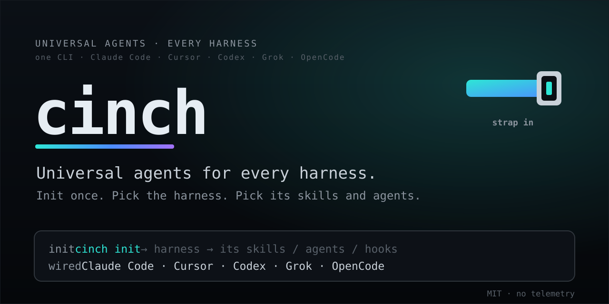

<div align="center">
  

  <p><strong>Universal agents and skills for every AI harness. Init once, deploy anywhere.</strong></p>

  <a href="LICENSE"></a>
  <a href="https://github.com/00200200/cinch/actions/workflows/ci.yml"></a>
  <a href="https://github.com/00200200/cinch/stargazers"></a>
</div>

<br />

<div align="center">
  <!-- Asciinema / GIF Animation Placeholder -->
  <a href="#">
    
  </a>
  <p><em>See how cinch configures your workspace in seconds.</em></p>
</div>

## 🚀 Why Cinch?

Stop rewriting your AI tool configurations for every new project. You already have custom skills, agents, and hooks sitting on your machine for Claude Code, Cursor, Codex, and others.

**Cinch** is the universal glue. It detects your installed AI harnesses, inventories your local skills, and seamlessly wires them into your project's expected layout. No bundled marketplace, no redundant skill libraries—just one `init` to bring your favorite AI agents to any project.

## ✨ Features

- 🔍 **Auto-Discovery:** Automatically finds skills, agents, and hooks in your local directories (e.g., `~/.claude`, `~/.cursor`).
- ⚡ **Zero Friction:** One command copies your selection into the correct project folder structure.
- 🌐 **Universal Support:** Claude Code, Cursor, Codex, Grok, OpenCode, Continue, Aider, Windsurf, Cline, Gemini CLI, and GitHub Copilot.
- 🔒 **Local First:** Operates entirely on your machine. No scraping, no telemetry, no BS.

## 📦 Quick Start

Run cinch interactively without installing:

```bash
uvx --from git+https://github.com/00200200/cinch cinch init
```

Or run non-interactively to instantly configure a workspace:

```bash
uvx --from git+https://github.com/00200200/cinch cinch init \
  --harness claude --skills humanizer --agents reviewer --yes
```

## 🛠 Core Commands

| Command | Description |
| :--- | :--- |
| `cinch harnesses` | Shows supported and locally installed harnesses. |
| `cinch inventory --harness <name>` | Lists available skills, agents, hooks, etc., for a given harness. |
| `cinch init` | Wires selected skills and agents into your current repository. |

## 🤝 Supported Harnesses

<p align="center">
  
</p>

Cinch intelligently maps your local inventory to the project wiring needed for each product. For example, it maps `~/.claude/{skills,agents}` to `.claude/…` or `~/.cursor/hooks` to `.cursor/…`.

---

<div align="center">
  <strong>If Cinch saves you time, please consider giving it a ⭐ on GitHub!</strong>
</div>
